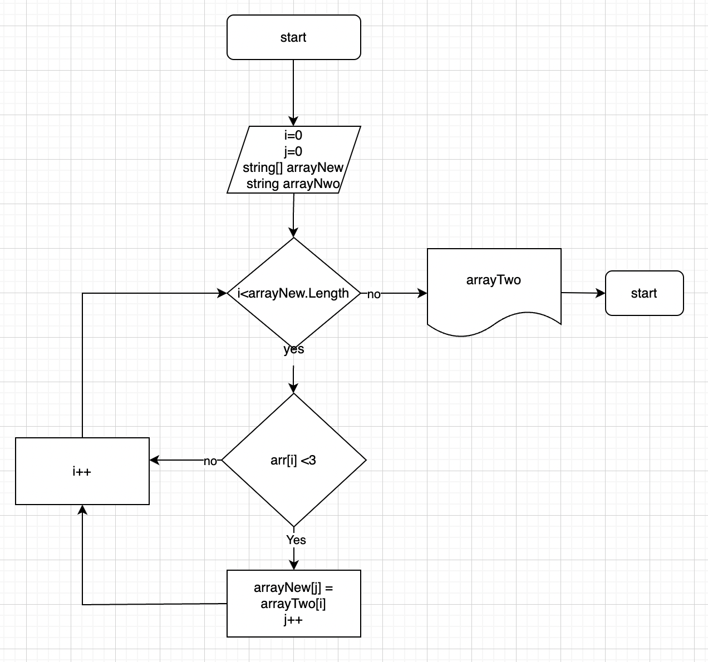

# Итоговая работа

## Задача:

Написать программу, которая из имеющегося массива строк, формирут массив стрк, дина которых меньше или равна 3. Первоначальный массив можно вывести с клавиатуры
// либо задать на старте выполнения алгоритма.

**Примеры:** ["hellow" "2", "world", ";-"] -> ["2", ";-"]

## Алгоритм решения

1. Создали строковый массив
2. Создали метод заполнения массива (*FillArray*), заполняющий массив значениями введенными пользователем
3. Создали метот вывода массива на экран (*PrintArray*)
4. Создали метод определяющий длину нового массива (*GetSecondMass* )
5. Создали условие окончания решения если размер втрого массива рвен 0
6. Создали метот переносящий элемент в новый массив (*TransferElements*)
7. Вывели на экран новый массив

Добавили блок схему
